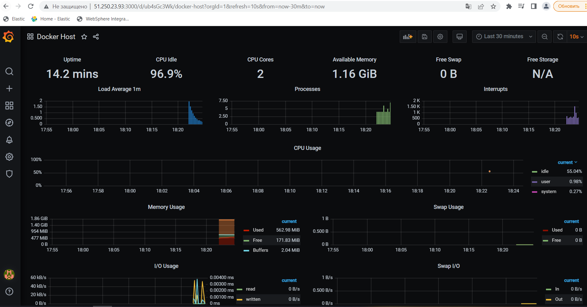

# Домашнее задание к занятию "5.4. Оркестрация группой Docker контейнеров на примере Docker Compose"


## Задача 1

Создать собственный образ операционной системы с помощью Packer.

### Ответ:  
```
yc compute image list
```  
+----------------------+---------------+--------+----------------------+--------+  
|          ID          |     NAME      | FAMILY |     PRODUCT IDS      | STATUS |  
+----------------------+---------------+--------+----------------------+--------+  
| fd8a048f545c36us734c | centos-7-base | centos | f2euv1kekdgvc0jrpaet | READY  |  
+----------------------+---------------+--------+----------------------+--------+  
  
<p align="center">
  
</p>

## Задача 2

Создать вашу первую виртуальную машину в Яндекс.Облаке.


### Ответ:  
```
yc compute instance list
```
+----------------------+------+---------------+---------+--------------+-------------+  
|          ID          | NAME |    ZONE ID    | STATUS  | EXTERNAL IP  | INTERNAL IP |  
+----------------------+------+---------------+---------+--------------+-------------+  
| epdnm6iqsu902odr02qd |      | ru-central1-b | RUNNING | 51.250.23.93 | 10.129.0.13 |  
+----------------------+------+---------------+---------+--------------+-------------+  

<p align="center">
  
</p>

## Задача 3

Создать ваш первый готовый к боевой эксплуатации компонент мониторинга, состоящий из стека микросервисов.

### Ответ:  
<p align="center">
  
</p>
