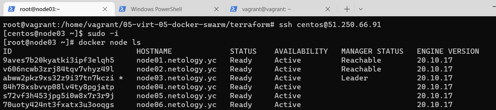
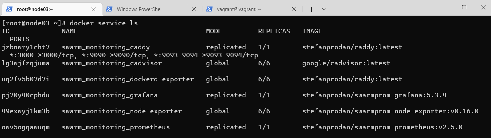

# Домашнее задание к занятию "5.5. Оркестрация кластером Docker контейнеров на примере Docker Swarm"

---

## Задача 1

Дайте письменые ответы на следующие вопросы:

- В чём отличие режимов работы сервисов в Docker Swarm кластере: replication и global?
- Какой алгоритм выбора лидера используется в Docker Swarm кластере?
- Что такое Overlay Network?  

### Ответ:  
- В режиме replication сервис будет работать на всех воркарах как единый, в режиме же global сервис будет работать на каждой ноде по отдельности;
- Если лидер пропадает(хост перезагружен/выключен) то между менеджерами происходит голосование(3-4 секунды) при котором выбирается лидер;
- Это виртуальная подсеть Docker Swarm, которая создаётся с помощью физической сети самих нод в составе Docker Swarm
#### Правки:
1. Да, я не совсем правильно понял, в replication указывается сразу ограниченное количество запущенных процессов, а в global просто новый процесс будет запускаться на всех нодах;
2. Не смог найти точное время в документации, пересмотрел этот момент вебинара - лектор обговаривает время в 2-4 секунды;
3. Это сеть, которая создаётся именно службами\демонами Docker Swarm чтобы общаться напрямую, что позволяет избегать уровня ОС.

## Задача 2

Создать ваш первый Docker Swarm кластер в Яндекс.Облаке

### Ответ:  
```
docker node ls
```
<p align="center">
  
</p>


## Задача 3

Создать ваш первый, готовый к боевой эксплуатации кластер мониторинга, состоящий из стека микросервисов.

### Ответ:  
```
docker service ls
```
<p align="center">
  
</p>
