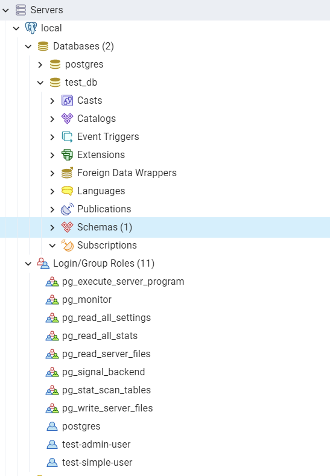
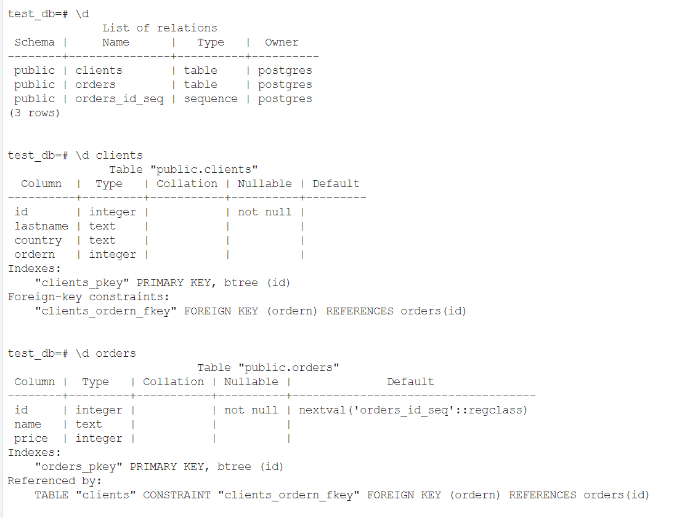
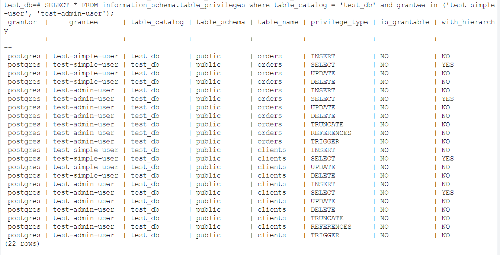
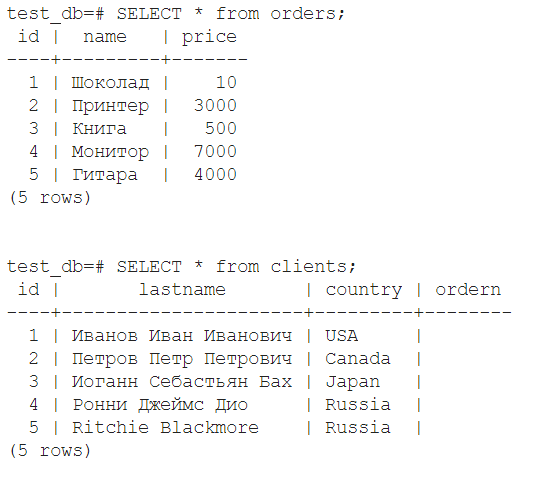
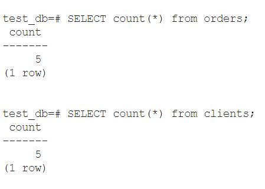
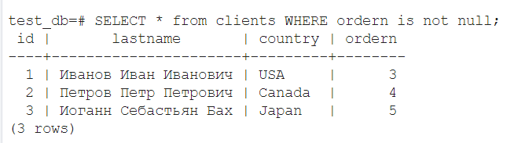

# Домашнее задание к занятию "6.2. SQL"


## Задача 1

Используя docker поднимите инстанс PostgreSQL (версию 12) c 2 volume, 
в который будут складываться данные БД и бэкапы.

Приведите получившуюся команду или docker-compose манифест.

### Ответ:  
docker-compose:
```yaml
version: "3.9"
services:
  postgres:
    image: postgres:12
    environment:
      POSTGRES_PASSWORD: "postgres"
    ports:
      - "5432:5432"
    volumes:
      - vol1:/var/lib/postgresql/data
      - vol2:/var/lib/postgresql/bckp
volumes:
  vol1:
  vol2:
```

## Задача 2

В БД из задачи 1: 
- создайте пользователя test-admin-user и БД test_db
- в БД test_db создайте таблицу orders и clients (спeцификация таблиц ниже)
- предоставьте привилегии на все операции пользователю test-admin-user на таблицы БД test_db
- создайте пользователя test-simple-user  
- предоставьте пользователю test-simple-user права на SELECT/INSERT/UPDATE/DELETE данных таблиц БД test_db

Таблица orders:
- id (serial primary key)
- наименование (string)
- цена (integer)

Таблица clients:
- id (serial primary key)
- фамилия (string)
- страна проживания (string, index)
- заказ (foreign key orders)

Приведите:
- итоговый список БД после выполнения пунктов выше,
- описание таблиц (describe)
- SQL-запрос для выдачи списка пользователей с правами над таблицами test_db
- список пользователей с правами над таблицами test_db

### Ответ:  
Итоговый список БД после выполнения пунктов выше:  
<p align="left">
  
</p>

Описание таблиц (describe)
<p align="left">
  
</p>

SQL-запрос для выдачи списка пользователей с правами над таблицами test_db:  
`SELECT * FROM information_schema.table_privileges where table_catalog = 'test_db';`


Список пользователей с правами над таблицами test_db (ограничил пользователями test-admin-user и test-admin-user):
`SELECT * FROM information_schema.table_privileges where table_catalog = 'test_db' and grantee in ('test-simple
-user', 'test-admin-user');`
<p align="left">
  
</p>

## Задача 3

Используя SQL синтаксис - наполните таблицы следующими тестовыми данными:

Таблица orders

|Наименование|цена|
|------------|----|
|Шоколад| 10 |
|Принтер| 3000 |
|Книга| 500 |
|Монитор| 7000|
|Гитара| 4000|

Таблица clients

|ФИО|Страна проживания|
|------------|----|
|Иванов Иван Иванович| USA |
|Петров Петр Петрович| Canada |
|Иоганн Себастьян Бах| Japan |
|Ронни Джеймс Дио| Russia|
|Ritchie Blackmore| Russia|

Используя SQL синтаксис:
- вычислите количество записей для каждой таблицы 
- приведите в ответе:
    - запросы 
    - результаты их выполнения.


### Ответ:  
test_db=# INSERT into orders VALUES (1, 'Шоколад', 10), (2, 'Принтер', 3000), (3, 'Книга', 500), (4, 'Монитор', 7000), (
5, 'Гитара', 4000);  
test_db=# INSERT into clients VALUES (1, 'Иванов Иван Иванович', 'USA'), (2, 'Петров Петр Петрович', 'Canada'), (3, 'Иог
анн Себастьян Бах', 'Japan'), (4, 'Ронни Джеймс Дио', 'Russia'), (5, 'Ritchie Blackmore', 'Russia');  
<p align="center">
  
</p>

`SELECT count(*) from orders;`  
`SELECT count(*) from clients;`  

<p align="left">
  
</p>


## Задача 4

Часть пользователей из таблицы clients решили оформить заказы из таблицы orders.

Используя foreign keys свяжите записи из таблиц, согласно таблице:

|ФИО|Заказ|
|------------|----|
|Иванов Иван Иванович| Книга |
|Петров Петр Петрович| Монитор |
|Иоганн Себастьян Бах| Гитара |

Приведите SQL-запросы для выполнения данных операций.

Приведите SQL-запрос для выдачи всех пользователей, которые совершили заказ, а также вывод данного запроса.
 
Подсказк - используйте директиву `UPDATE`.

### Ответ:  
Update:  
`UPDATE clients set ordern = 3 where id = 1;`  
`UPDATE clients set ordern = 4 where id = 2;`  
`UPDATE clients set ordern = 5 where id = 3;`  

Select:  
`SELECT * from clients WHERE ordern is not null;`

<p align="left">
  
</p>


## Задача 5

Получите полную информацию по выполнению запроса выдачи всех пользователей из задачи 4 
(используя директиву EXPLAIN).

Приведите получившийся результат и объясните что значат полученные значения.

### Ответ:  
`EXPLAIN SELECT * from clients WHERE ordern is not null;`

                        QUERY PLAN  
-----------------------------------------------------------
 Seq Scan on clients  (cost=0.00..18.10 rows=806 width=72)  
   Filter: (ordern IS NOT NULL)  
   
`EXPLAIN` вычисляет стоимость (время выполнения запроса), а также показывает как будут сканироваться таблицы. 


## Задача 6

Создайте бэкап БД test_db и поместите его в volume, предназначенный для бэкапов (см. Задачу 1).

Остановите контейнер с PostgreSQL (но не удаляйте volumes).

Поднимите новый пустой контейнер с PostgreSQL.

Восстановите БД test_db в новом контейнере.

Приведите список операций, который вы применяли для бэкапа данных и восстановления. 

### Ответ:  
```
root@vagrant:/var/lib/docker/volumes/postgredock_vol2/_data# docker ps
CONTAINER ID   IMAGE         COMMAND                  CREATED       STATUS       PORTS
     NAMES
177544b5a256   postgres:12   "docker-entrypoint.s…"   3 hours ago   Up 3 hours   0.0.0.0:5432->5432/tcp, :::5432->5432/tcp   postgredock-postgres-1
root@vagrant:/var/lib/docker/volumes/postgredock_vol2/_data# docker exec -t postgredock-postgres-1 pg_dump -U postgres test_db -f /var/lib/postgresql/bckp/dump_test.sql
root@vagrant:/var/lib/docker/volumes/postgredock_vol2/_data# ls
dump_test.sql
```
Останавливаем наш compose с помощью `docker-compose stop` и поднимаем новый контейнер с postgre:
```
root@vagrant:/home/# docker run -d --name postgresdock -e POSTGRES_PASSWORD=postgres -d -p 5432:5432 -v vol3:/var/lib/postgresql/data  --mount type=volume,source=postgredock_vol2,destination=/home/tst postgres:12
```
Создаём БД в контейнере:
```
root@vagrant:/home/# docker exec -ti postgresdock psql -U postgres -c 'create database test_db;'
```
Заливаем бэкап:
```
root@vagrant:/home/# docker exec postgresdock7 psql -U postgres -d test_db -f /home/tst/dump_test.sql
SET
SET
SET
SET
SET
 set_config
------------

(1 row)

SET
SET
SET
SET
SET
SET
CREATE TABLE
ALTER TABLE
CREATE TABLE
ALTER TABLE
CREATE SEQUENCE
ALTER TABLE
ALTER SEQUENCE
ALTER TABLE
COPY 5
COPY 5
 setval
--------
      1
(1 row)

ALTER TABLE
ALTER TABLE
ALTER TABLE
```
