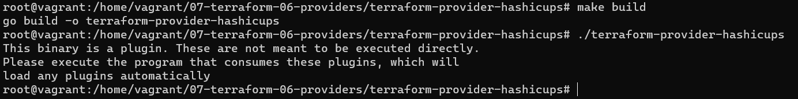

# Домашнее задание к занятию "7.6. Написание собственных провайдеров для Terraform."

Бывает, что 
* общедоступная документация по терраформ ресурсам не всегда достоверна,
* в документации не хватает каких-нибудь правил валидации или неточно описаны параметры,
* понадобиться использовать провайдер без официальной документации,
* может возникнуть необходимость написать свой провайдер для системы используемой в ваших проектах.   

## Задача 1. 
Давайте потренируемся читать исходный код AWS провайдера, который можно склонировать от сюда: 
[https://github.com/hashicorp/terraform-provider-aws.git](https://github.com/hashicorp/terraform-provider-aws.git).
Просто найдите нужные ресурсы в исходном коде и ответы на вопросы станут понятны.  


1. Найдите, где перечислены все доступные `resource` и `data_source`, приложите ссылку на эти строки в коде на 
гитхабе.   
1. Для создания очереди сообщений SQS используется ресурс `aws_sqs_queue` у которого есть параметр `name`. 
    * С каким другим параметром конфликтует `name`? Приложите строчку кода, в которой это указано.
    * Какая максимальная длина имени? 
    * Какому регулярному выражению должно подчиняться имя? 
    
### Ответ:


## Задача 2. (Не обязательно) 
В рамках вебинара и презентации мы разобрали как создать свой собственный провайдер на примере кофемашины. 
Также вот официальная документация о создании провайдера: 
[https://learn.hashicorp.com/collections/terraform/providers](https://learn.hashicorp.com/collections/terraform/providers).

1. Проделайте все шаги создания провайдера.
2. В виде результата приложение ссылку на исходный код.
3. Попробуйте скомпилировать провайдер, если получится то приложите снимок экрана с командой и результатом компиляции.   

### Ответ:
Код data_source_coffee.go -   

Компиляция и успешный запуск: 
<p align="center">
  
</p>  

Выполнение `terraform init && terraform apply --auto-approve` для собранного провайдера (main.tf - https://github.com/la3ft/devops-netology/blob/main/DZ/07-terraform-06-providers/main.tf):
```
root@vagrant:/home/vagrant/07-terraform-06-providers/terraform-provider-hashicups# terraform init -upgrade && terraform apply --auto-approve

Initializing the backend...

Initializing provider plugins...
- Finding hashicorp.com/edu/hashicups versions matching "~> 0.3.1"...
- Installing hashicorp.com/edu/hashicups v0.3.1...
- Installed hashicorp.com/edu/hashicups v0.3.1 (unauthenticated)

Terraform has made some changes to the provider dependency selections recorded
in the .terraform.lock.hcl file. Review those changes and commit them to your
version control system if they represent changes you intended to make.

Terraform has been successfully initialized!

You may now begin working with Terraform. Try running "terraform plan" to see
any changes that are required for your infrastructure. All Terraform commands
should now work.

If you ever set or change modules or backend configuration for Terraform,
rerun this command to reinitialize your working directory. If you forget, other
commands will detect it and remind you to do so if necessary.

Terraform used the selected providers to generate the following execution plan. Resource actions are indicated with the following symbols:
  + create

Terraform will perform the following actions:

  # hashicups_order.edu will be created
  + resource "hashicups_order" "edu" {
      + id           = (known after apply)
      + last_updated = (known after apply)

      + items {
          + quantity = 2

          + coffee {
              + description = (known after apply)
              + id          = 3
              + image       = (known after apply)
              + name        = (known after apply)
              + price       = (known after apply)
              + teaser      = (known after apply)
            }
        }
      + items {
          + quantity = 2

          + coffee {
              + description = (known after apply)
              + id          = 2
              + image       = (known after apply)
              + name        = (known after apply)
              + price       = (known after apply)
              + teaser      = (known after apply)
            }
        }
    }

Plan: 1 to add, 0 to change, 0 to destroy.

Changes to Outputs:
  + edu_order = {
      + id           = (known after apply)
      + items        = [
          + {
              + coffee   = [
                  + {
                      + description = (known after apply)
                      + id          = 3
                      + image       = (known after apply)
                      + name        = (known after apply)
                      + price       = (known after apply)
                      + teaser      = (known after apply)
                    },
                ]
              + quantity = 2
            },
          + {
              + coffee   = [
                  + {
                      + description = (known after apply)
                      + id          = 2
                      + image       = (known after apply)
                      + name        = (known after apply)
                      + price       = (known after apply)
                      + teaser      = (known after apply)
                    },
                ]
              + quantity = 2
            },
        ]
      + last_updated = (known after apply)
    }
hashicups_order.edu: Creating...
hashicups_order.edu: Creation complete after 0s [id=2]

Apply complete! Resources: 1 added, 0 changed, 0 destroyed.

Outputs:

edu_order = {
  "id" = "2"
  "items" = tolist([
    {
      "coffee" = tolist([
        {
          "description" = ""
          "id" = 3
          "image" = "/nomad.png"
          "name" = "Nomadicano"
          "price" = 150
          "teaser" = "Drink one today and you will want to schedule another"
        },
      ])
      "quantity" = 2
    },
    {
      "coffee" = tolist([
        {
          "description" = ""
          "id" = 2
          "image" = "/vault.png"
          "name" = "Vaulatte"
          "price" = 200
          "teaser" = "Nothing gives you a safe and secure feeling like a Vaulatte"
        },
      ])
      "quantity" = 2
    },
  ])
  "last_updated" = tostring(null)
}
```
